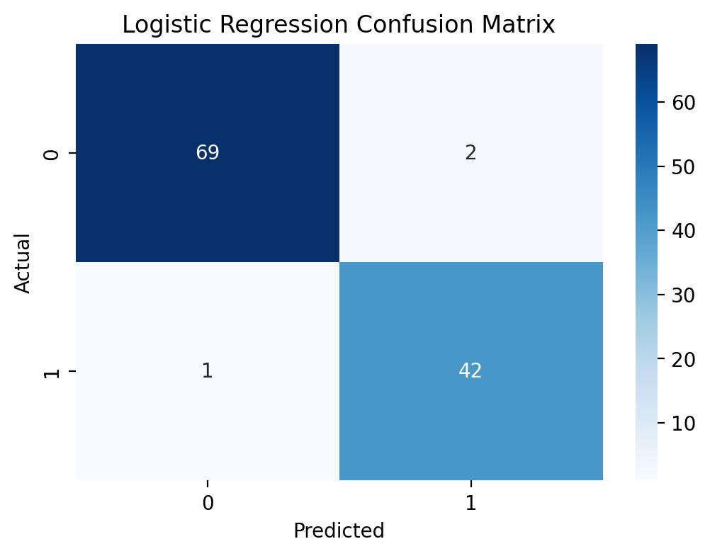
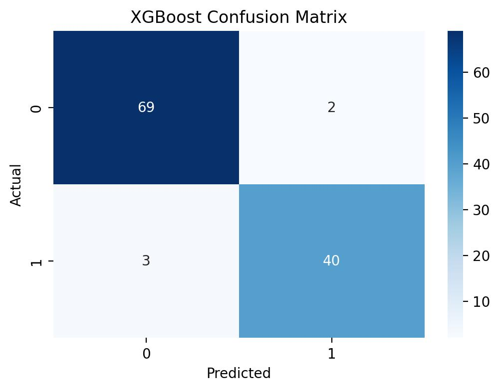

# End-to-end MLOps pipeline for Breast Cancer diagnosis with Logistic Regression & XGBoost, featuring MLflow tracking and Dockerized deployment.


A machine learning pipeline for predicting breast cancer diagnosis using Logistic Regression and XGBoost. Implements MLOps with data preprocessing, model training, evaluation, and MLflow tracking.

## ✨ Key Features

- Modular architecture with separate components for data ingestion, transformation, training, and monitoring
- Automated data pipeline with preprocessing and train-test splitting
- Multiple models: Logistic Regression and XGBoost with hyperparameter tuning
- Comprehensive evaluation with classification reports and confusion matrices
- MLflow integration for experiment tracking
- Docker support for containerized deployment
- Jupyter notebook for interactive analysis
- Logging system and artifact management

## 🏗️ Project Structure

```
week1_p1/
├── src/Breast_Cancer_prediction/
│   ├── components/           # Core ML components (ingestion, transformation, training)
│   ├── pipelines/            # End-to-end pipeline scripts
│   ├── exception.py          # Custom exceptions
│   ├── logger.py             # Logging config
│   ├── mlflow_utils.py       # MLflow utilities
│   └── utils.py              # Helper functions
├── artifacts/                # Generated models, data, and visualizations
├── mlruns/                   # MLflow tracking data
├── notebook/                 # Jupyter notebook for analysis
├── app.py                    # Main application
├── main.py                   # Model inspection
├── Dockerfile                # Docker config
├── requirements.txt          # Dependencies
└── README.md
```

## 🚀 Quick Start

### Prerequisites
- Python 3.8+
- pip or conda

### Installation
1. Clone the repository and navigate to the project directory.
2. Create a virtual environment:
   ```bash
   python -m venv venv
   source venv/bin/activate  # Windows: venv\Scripts\activate
   ```
3. Install dependencies:
   ```bash
   pip install -r requirements.txt
   ```

### Running the Pipeline
```bash
# Run the complete ML pipeline
python app.py

# Inspect the trained model
python main.py

# Explore the notebook
jupyter notebook notebook/Breast_Cancer.ipynb
```

## 📊 Dataset

The dataset contains 569 samples with 30 numerical features derived from breast mass images. Target: diagnosis (B = Benign, M = Malignant).

## 🔧 Pipeline Overview

- **Data Ingestion**: Loads data, performs train-test split (80/20)
- **Data Transformation**: Handles missing values, scaling, encoding
- **Model Training**: Trains Logistic Regression and XGBoost with GridSearchCV
- **Evaluation**: Generates reports, confusion matrices, and metrics

## 🤖 Models

- **Logistic Regression**: Tuned for C, solver, max_iter
- **XGBoost**: Tuned for learning_rate, subsample, max_depth, n_estimators

## 📈 MLflow Tracking

Tracks experiments, parameters, metrics, and artifacts. Start UI with `mlflow ui`.

## 🐳 Docker


## 📋 Dependencies

- pandas, numpy
- scikit-learn==1.6.1
- xgboost
- mlflow
- matplotlib, seaborn

## 🔍 Usage

```python
from src.Breast_Cancer_prediction.components.data_ingestion import DataIngestion
from src.Breast_Cancer_prediction.components.model_trainer import ModelTrainer

# Run pipeline
data_ingestion = DataIngestion()
train_path, test_path = data_ingestion.initiate_data_ingestion()

model_trainer = ModelTrainer()
reports = model_trainer.initiate_model_trainer(train_path, test_path)
```

## 📊 Results

Example Confusion Matrix:
<<<<<<< HEAD


=======

>>>>>>> 7a15055b5ed4f7f00835a35561fbcfaeb469d596

Example MLflow Tracking:


## 🤝 Contributing

1. Fork the repo
2. Create a feature branch
3. Commit changes
4. Push and open a Pull Request

## 📄 License

MIT License

## 👥 Authors

- Manish Kumar - [GitHub](https://github.com/mayra071)

## 🙏 Acknowledgments

- University of Wisconsin Hospitals for the dataset
- Scikit-learn, MLflow, XGBoost communities

- 


